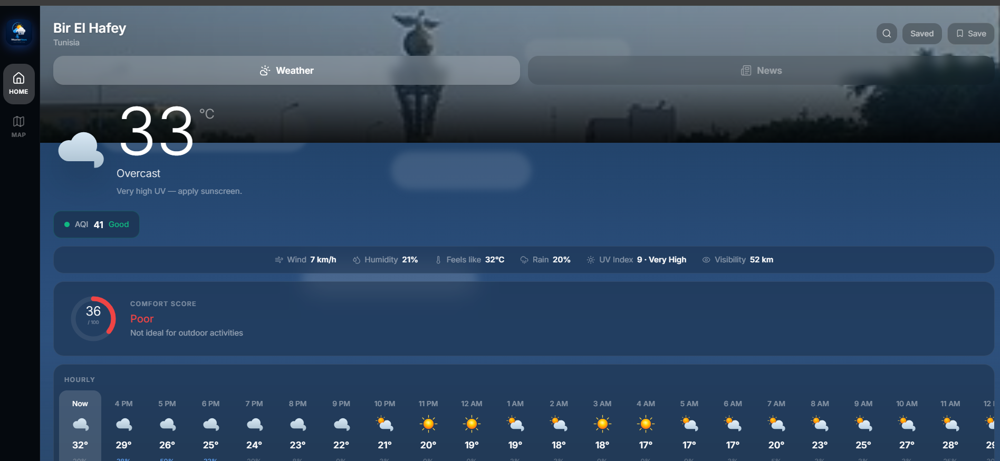
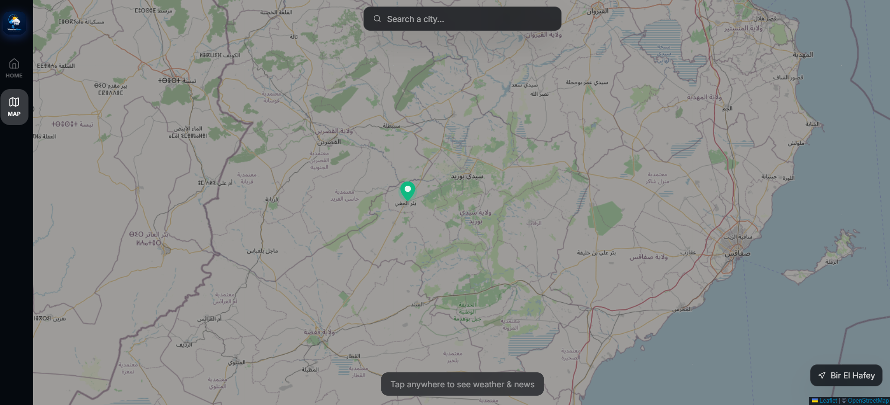
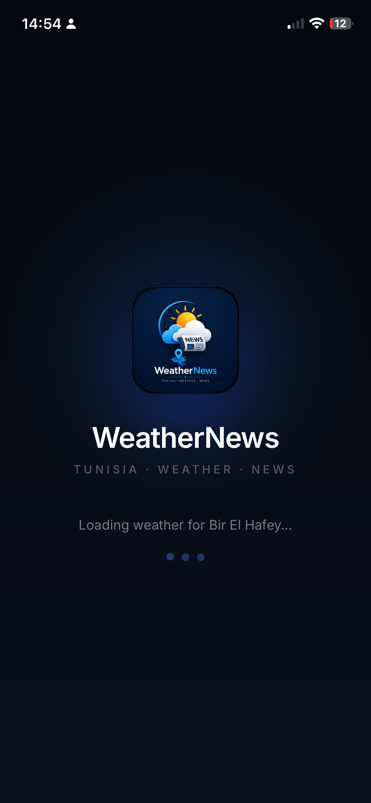
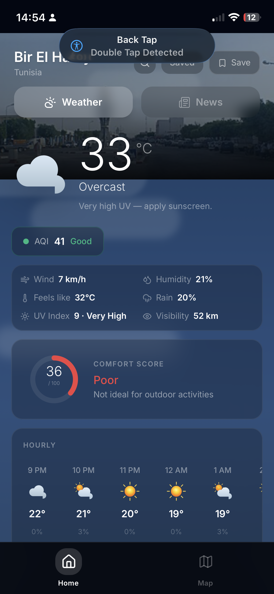
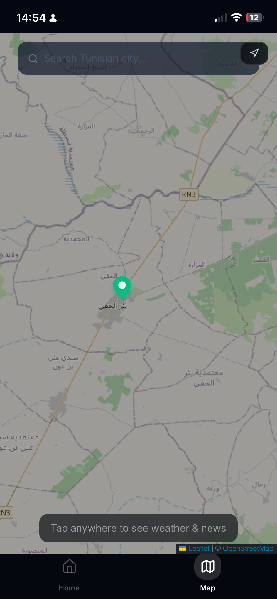

# WeatherNews Tunisia

Real-time weather forecasts and local Tunisian news, deployed on Vercel.

**Live:** https://weather-news-app-gray.vercel.app

---

## Screenshots

### Desktop






### Mobile

<p float="left">
  
  
  
  
</p>

---

## Stack

| Layer | Technology |
|-------|-----------|
| Frontend | React 18, Vite 5, Tailwind CSS 3 |
| UI Icons | Lucide React |
| Map | Leaflet.js, React-Leaflet |
| Backend | Vercel Serverless Functions (Node.js 18) |
| Weather & AQI | Open-Meteo — free, no API key |
| Air Quality | Open-Meteo Air Quality API — free, no API key |
| Geocoding | Open-Meteo Geocoding API — filtered to Tunisia |
| Reverse Geocoding | Nominatim OpenStreetMap — free, no API key |
| IP Geolocation | ip-api.com — server-side, free, no API key |
| News | Tunisian RSS feeds — no API key |
| City Images | Wikipedia REST API — free, no API key |

---

## Architecture

```
/
├── api/                  Vercel Serverless Functions
│   ├── weather.js
│   ├── aqi.js
│   ├── news.js
│   ├── geocode.js
│   └── detect-city.js
├── src/
│   ├── components/
│   ├── lib/
│   │   ├── api.js        API helpers + localStorage saved places
│   │   └── weatherIcons.js
│   └── pages/
│       ├── Home.jsx
│       └── Map.jsx
├── public/
│   └── logo.png
├── vercel.json
└── vite.config.js
```

Saved places are stored in `localStorage` — no database, no authentication required. All data fetching is handled server-side through `/api/*` Vercel functions to keep API calls server-to-server.

---

## API Reference

### GET /api/weather

Fetches current conditions, 24-hour hourly data and 7-day daily forecast.

**Query parameters**

| Parameter | Type | Required | Description |
|-----------|------|----------|-------------|
| `lat` | number | yes | Latitude |
| `lon` | number | yes | Longitude |

**Response fields (hourly):** `temperature_2m`, `weathercode`, `relative_humidity_2m`, `apparent_temperature`, `precipitation_probability`, `windspeed_10m`, `uv_index`, `visibility`

**Response fields (daily):** `weathercode`, `temperature_2m_max`, `temperature_2m_min`, `precipitation_sum`, `windspeed_10m_max`, `uv_index_max`

**Cache:** `s-maxage=600`

---

### GET /api/aqi

Fetches US Air Quality Index and PM2.5 concentration.

**Query parameters**

| Parameter | Type | Required | Description |
|-----------|------|----------|-------------|
| `lat` | number | yes | Latitude |
| `lon` | number | yes | Longitude |

**Response**

```json
{ "aqi": 42, "pm25": 8.3 }
```

**Cache:** `s-maxage=600`

---

### GET /api/news

Fetches articles from 8 Tunisian RSS sources in parallel. Filters by city keyword if results exceed 2 matches; falls back to national Tunisia feed.

**Query parameters**

| Parameter | Type | Required | Description |
|-----------|------|----------|-------------|
| `city` | string | yes | City name for keyword filtering |
| `country` | string | no | Country name for secondary fallback |

**Response**

```json
{
  "articles": [
    {
      "title": "...",
      "url": "...",
      "source": { "name": "Mosaique FM" },
      "publishedAt": "2025-05-30T14:00:00Z",
      "description": "...",
      "urlToImage": "..."
    }
  ],
  "label": "Sfax"
}
```

**Sources:** Mosaique FM, Tunisie Numérique, Kapitalis, Business News TN, Webdo, HuffPost Maghreb, Shems FM, TAP

**Cache:** `s-maxage=1800`

---

### GET /api/geocode

City name search restricted to Tunisia (`country_code=TN`).

**Query parameters**

| Parameter | Type | Required | Description |
|-----------|------|----------|-------------|
| `q` | string | yes | Search query |

**Response**

```json
[
  { "name": "Sfax, Sfax — Tunisia", "city": "Sfax", "lat": 34.74, "lon": 10.76 }
]
```

**Cache:** `s-maxage=86400`

---

### GET /api/detect-city

Server-side IP geolocation. Reads `x-forwarded-for` header provided by Vercel; bypasses client-side ad blockers.

**No query parameters.**

**Response**

```json
{ "city": "Sfax", "lat": 34.74, "lon": 10.76, "country": "Tunisia" }
```

---

## Location Detection Flow

```
1. Browser Geolocation API
   timeout: 12s, maximumAge: 120s, enableHighAccuracy: false
   → Nominatim reverse geocode → city name

2. Server-side IP (if GPS denied or timed out)
   GET /api/detect-city → ip-api.com

3. Default fallback
   Tunis (36.8065, 10.1815)
```

---

## WMO Weather Code Mapping

Open-Meteo returns [WMO weather codes](https://open-meteo.com/en/docs). The app maps them to custom SVG icons and sky gradient styles.

| Code range | Condition | Icon | Sky (day) |
|-----------|-----------|------|-----------|
| 0 | Clear sky | Sun with rays | Bright blue gradient |
| 1–2 | Partly cloudy | Sun behind cloud | Slate blue gradient |
| 3 | Overcast | Cloud | Dark slate gradient |
| 45–48 | Fog | Horizontal lines | Dark slate gradient |
| 51–57 | Drizzle | Cloud + light drops | Dark slate gradient |
| 61–67 | Rain | Cloud + blue drops | Dark navy gradient |
| 71–77 | Snow | Cloud + snowflake | Indigo gradient |
| 80–82 | Showers | Sun + cloud + drops | Dark slate gradient |
| 95–99 | Thunderstorm | Dark cloud + lightning | Near-black gradient |

---

## Comfort Score Algorithm

Calculated from current-hour data. Score range: 0–100.

```
tempScore  = max(0, 30 − |feelsLike − 23| × 2.5)
humScore   = max(0, 25 − max(0, |humidity − 50| − 8) × 1.6)
uvScore    = max(0, 15 − uv × 1.5)
rainScore  = max(0, 20 − rain × 0.22)
windScore  = wind ≤ 25 ? 10 : max(0, 10 − (wind − 25) × 0.3)

score = round(min(100, tempScore + humScore + uvScore + rainScore + windScore))
```

| Range | Label |
|-------|-------|
| 85–100 | Excellent |
| 70–84 | Good |
| 55–69 | Fair |
| 35–54 | Poor |
| 0–34 | Very Poor |

---

## Vercel Configuration

```json
{
  "outputDirectory": "dist",
  "buildCommand": "npm run build",
  "rewrites": [
    { "source": "/api/(.*)", "destination": "/api/$1" },
    { "source": "/((?!api/).*)", "destination": "/index.html" }
  ],
  "functions": {
    "api/**/*.js": { "memory": 256, "maxDuration": 10 }
  }
}
```

---

## License

MIT — Adem Hmercha
